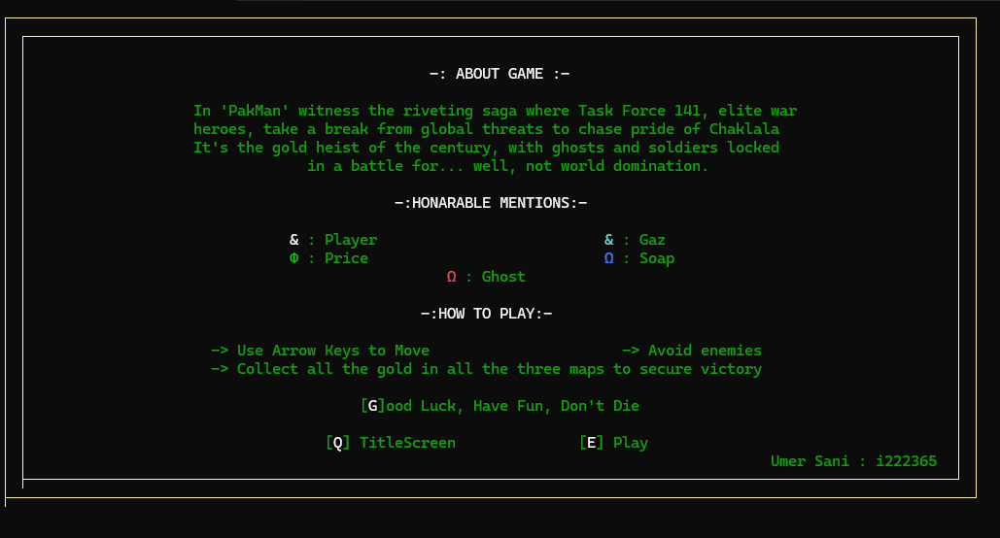

# PakMan

PakMan is an assembly language game inspired by the classic Pac-Man. The game features multiple levels, sound effects, and special fruits to collect. The player navigates through the maze, collects dots, and avoids ghosts to complete each level.

## Table of Contents

- [Installation](#installation)
- [Usage](#usage)
- [Game Controls](#game-controls)
- [Levels](#levels)
- [Sound Effects](#sound-effects)
- [GUI Screenshots](#gui-screenshots)
- [Contributing](#contributing)
- [License](#license)

## Installation

### Prerequisites

- Microsoft Visual Studio with MASM (Microsoft Macro Assembler) support
- Irvine32 library

### Installation Steps

1. Clone the repository:
    ```sh
    git clone https://github.com/yourusername/pakman.git
    cd pakman
    ```

2. Open the solution file [`PakMan.sln`](PakMan.sln ) in Visual Studio.

3. Build the project by selecting `Build > Build Solution` or pressing `Ctrl+Shift+B`.

4. Run the project by selecting `Debug > Start Debugging` or pressing `F5`.

## Usage

- Use the arrow keys to move PakMan around the maze.
- Collect all the dots to complete the level.
- Avoid the ghosts, or you will lose a life.
- Collect special fruits for bonus points.
- Complete all levels to win the game.

## Game Controls

- **Arrow Keys**: Move PakMan
- **Q**: Go to Wiki/How to Play
- **E**: Play the game or proceed to the next level

## Levels

The game includes three levels with increasing difficulty:
- **Level 1**: Kings Canyon
- **Level 2**: World's Edge
- **Level 3**: Olympus

## Sound Effects

The game includes various sound effects for different events:
- [aye.wav](sfx/aye.wav): Played when a ghost catches PakMan.
- [food.wav](sfx/food.wav): Played when PakMan collects a dot.
- [title.wav](sfx/title.wav): Played on the title screen.
- [Lvl1.wav](sfx/Lvl1.wav): Played when level 1 is completed.
- [Lvl2.wav](sfx/Lvl2.wav): Played when level 2 is completed.
- [win.wav](sfx/win.wav): Played when the game is won.
- [win1.wav](sfx/win1.wav): Alternate sound played when the game is won.
- [lvl1start.wav](sfx/lvl1start.wav): Played at the start of level 1.
- [lvl2start.wav](sfx/lvl2start.wav): Played at the start of level 2.
- [lvl3start.wav](sfx/lvl3start.wav): Played at the start of level 3.
- [namepls.wav](sfx/namepls.wav): Played when asking for the player's name.
- [theme.wav](sfx/theme.wav): Background music.
- [lose1.wav](sfx/lose1.wav): Played when the player loses a life.
- [lose2.wav](sfx/lose2.wav): Alternate sound played when the player loses a life.
- [lose3.wav](sfx/lose3.wav): Another alternate sound played when the player loses a life.
- [howtoplay.wav](sfx/howtoplay.wav): Played on the how-to-play screen.
- [aboutgame.wav](sfx/aboutgame.wav): Played on the about game screen.
- [meetcharacters.wav](sfx/meetcharacters.wav): Played on the meet characters screen.
- [siuuu.wav](sfx/siuuu.wav): Played when the player completes a level.
- [moyemoye.wav](sfx/moyemoye.wav): Played on game over.
### Screenshots

| Title Screen | Wiki Page |
|--------------|-----------|
|  |  |

| Level 01 | Level 02 |
|----------|----------|
|  |  |

| Level 03 | Level Complete Screen |
|----------|-----------------------|
|  |  |

| Game Over Screen |
|------------------|
|  |

## Acknowledgments

- [Irvine32 Library](http://www.asmirvine.com/) for providing useful assembly language routines.
- Sound effects from various sources.